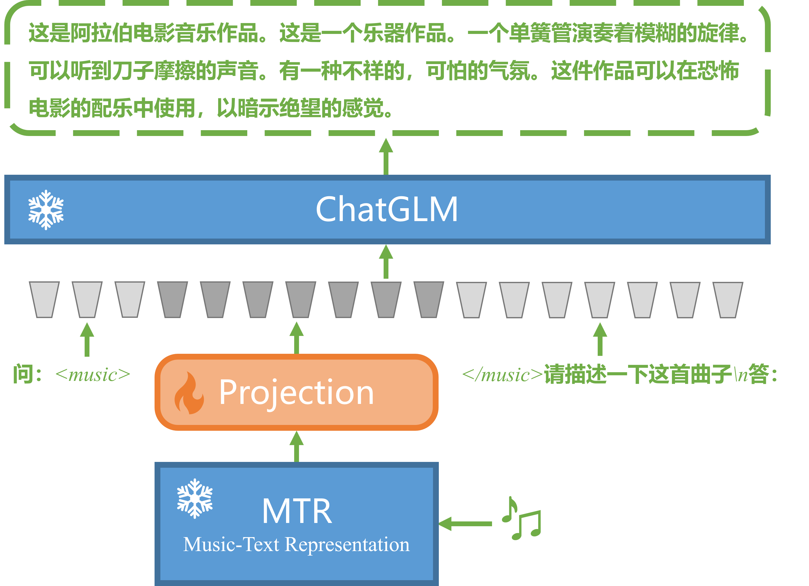

# MusicTextAlignment
[English](README.md)  |  [中文](README_ZH.md)  
## Describe
This is a dataset that aligns **piano music MIDI** with their corresponding **textual descriptions and comments**. It can be used for multi-modal models in music-text alignment tasks, similar to how visual-LLM (such as LLaVA, MiniGPT4 and VisualGLM) align image encodings with textual embeddings. 

## Dataset collection method
1. The **piano music MIDI** files are sourced from an open dataset [*GiantMIDI-Piano*](https://github.com/bytedance/GiantMIDI-Piano) provided by ByteDance. 
2. The associated descriptions and comment **texts** are collected from the video descriptions and the top 5 comments in the comment section of the source YouTube videos for the music.

## Dataset Format
1. The data format for this project is TSV (Tab-Separated Values) files, where tab characters are used as separators to record information about music MIDI and its corresponding textual data.
2. The dataset examples:  

| index | old_id | vid         | describe                                                                                    | reply_1                                                                     | reply_2                                                                          | reply_3                                                                   | reply_4                                                                           | reply_5                                                                           |  
|-------|--------|-------------|----------------------------------------------------------------------------------------------|-----------------------------------------------------------------------------|----------------------------------------------------------------------------------|---------------------------------------------------------------------------|-----------------------------------------------------------------------------------|-----------------------------------------------------------------------------------|  
| 0     | 1      | V8WvKK-1b2c | P.7 First Lesson 0:00. P.7 Up and Down 0:20. ... | "I played all these when I was learning to play as a kid in the 80s. Love this piano book! When I was about 7 years old, I started playing 'Evening Song' in a minor key because I thought it sounded better." | Wonderful and practical. I'm learning playing piano by this video. Appreciated for the useful lessons. | Спасибо большое за наглядное пособие по учебнику ️️️ | Thanks, very useful video, it’s really help for first timer. | I'm currently on the singing brook and the sharps and flats still intimidate and confuse me. But your videos are really helpful! Thank you! | 
|...|...|...|...|...|...|...|...|...|   

3. The dataset consists of 9 fields, namely: `index`, `old_id`, `vid`, `describe`, `reply_1`, `reply_2`, `reply_3`, `reply_4`, and `reply_5`. Here, `index` serves as the index number for each sample, `old_id` represents the preprocessed identifier (this field can be ignored by users), `vid` corresponds to the YouTube video ID (consistent with the 'vid' field in the [*GiantMIDI-Piano*](https://github.com/bytedance/GiantMIDI-Piano) dataset), `describe` is the text string of the video description set by the video uploader, and `reply_1` to `reply_5` are text strings of the top five comments in the comment section.
4. For information about the piano music MIDI audio file dataset, please refer to [*GiantMIDI-Piano*: https://github.com/bytedance/GiantMIDI-Piano](https://github.com/bytedance/GiantMIDI-Piano)

## Tips 
1. The textual data is collected from the Internet, hence there are significant differences in language, expression, and format. Please exercise discretion in assessing the data quality.
2. Please use the dataset within the specified guidelines. Any consequences arising from the use of the dataset are at your own risk.

## Some thoughts
### **MusicLLM**:
The diagram below depicts my designed large language model for understanding musical content, named **MusicLLM**. It draws inspiration from the *LLaVA*([Paper](https://arxiv.org/pdf/2304.08485.pdf), [Project](https://llava-vl.github.io/)) model structure, utilizing [*Music Text Representation*](https://github.com/seungheondoh/music-text-representation) as the music encoder and [*ChatGLM*](https://github.com/THUDM/ChatGLM-6B) as the large language model. A projection layer is added to align the music encoding with text embeddings. Notably, the parameters of the music encoder and the large language model remain unchanged, with only the projection layer parameters being trained. Of course, in the second phase, fine-tuning can be performed by updating the parameters of the projection layer and the large language model.   
  
  
  
I hope that **MusicLLM** can serve as a reference, and I look forward to your contributions in this field!

## License
This project is licensed under the [CC-BY 4.0](https://creativecommons.org/licenses/by/4.0/) license.  
Unless otherwise specified, all content in this project is licensed under the Creative Commons Attribution 4.0 International License.  
You are free to share, copy, distribute, perform, display, and adapt the content in this project, even for commercial purposes, as long as you provide appropriate attribution and indicate if changes were made. For more details, please refer to the [CC-BY 4.0](https://creativecommons.org/licenses/by/4.0/) license.

## Citation
Please consider citing my project in your publications if the project helps your research. BibTeX reference is as follow.
```bibtex
@misc{MusicTextAlignment,
  author = {Haitao Song},
  title = {Music and Text Alignment},
  year = {2023},
  howpublished = {\url{https://github.com/shtdbb/MusicTextAlignment}}
}
