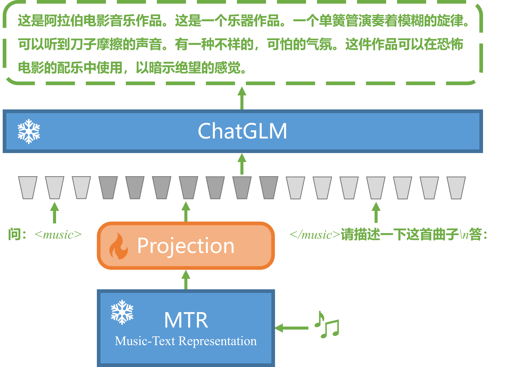

# MusicTextAlignment（音乐-文本对齐数据集）
[English](README.md) | [中文](README_ZH.md)  
## 简介
这是一个将钢琴曲 MIDI 和其相关的文本描述、评论对齐后的数据集。可以用于多模态模型的音乐-文本对齐任务中，例如类似于视觉大语言模型（如 LLaVA, MiniGPT4 和 VisualGLM）将图片编码与文本嵌入对齐。

## 数据集采集方式
1. **钢琴曲 MIDI** 来源于字节跳动的开源数据集 [*GiantMIDI-Piano*](https://github.com/bytedance/GiantMIDI-Piano)。
2. 钢琴曲相关的**描述和评论文本**，采集自音乐的源 YouTube 视频下的视频简介和评论区前 5 条评论。

## 数据集格式
1. 本项目数据集文件格式为 tsv 文件，即用制表符作为分隔符，对音乐 MIDI 和对应的文本数据进行记录。
2. 数据集示例如下:  

| index | old_id | vid         | describe                                                                                    | reply_1                                                                     | reply_2                                                                          | reply_3                                                                   | reply_4                                                                           | reply_5                                                                           |  
|-------|--------|-------------|----------------------------------------------------------------------------------------------|-----------------------------------------------------------------------------|----------------------------------------------------------------------------------|---------------------------------------------------------------------------|-----------------------------------------------------------------------------------|-----------------------------------------------------------------------------------|  
| 0     | 1      | V8WvKK-1b2c | P.7 First Lesson 0:00. P.7 Up and Down 0:20. ... | "I played all these when I was learning to play as a kid in the 80s. Love this piano book! When I was about 7 years old, I started playing 'Evening Song' in a minor key because I thought it sounded better." | Wonderful and practical. I'm learning playing piano by this video. Appreciated for the useful lessons. | Спасибо большое за наглядное пособие по учебнику ️️️ | Thanks, very useful video, it’s really help for first timer. | I'm currently on the singing brook and the sharps and flats still intimidate and confuse me. But your videos are really helpful! Thank you! | 
|...|...|...|...|...|...|...|...|...|   

3. 数据集包含 9 个字段, 分别为：`index`, `old_id`, `vid`, `describe`, `reply_1`, `reply_2`, `reply_3`, `reply_4`, 和 `reply_5`. 其中， `index` 表示每个样本的编号索引， `old_id` 表示预处理时的编号（此字段请使用者忽略即可）, `vid` 表示原 YouTuBe 视频 ID （与 [*GiantMIDI-Piano*](https://github.com/bytedance/GiantMIDI-Piano) 数据集的 'vid' 字段一致）， `describe` 为视频发布者设置的视频简介文本，`reply_1` 至 `reply_5` 依次为评论区的前 5 条评论的文本。
4. 有关钢琴曲 MIDI 的音频文件数据集内容，请参考 [*GiantMIDI-Piano*: https://github.com/bytedance/GiantMIDI-Piano](https://github.com/bytedance/GiantMIDI-Piano)。

## 提示 
1. 文本数据采集自互联网，故文本的语言、表达、格式存在较大差异，数据质量请大家自行甄别。
2. 请在相关规范内使用数据集，使用数据集引起的一切后果请自负。

## 一些想法
### **MusicLLM**：  
下图是我设计的能够理解音乐内容的大语言模型 **MusicLLM**，它参考了 *LLaVA*([Paper](https://arxiv.org/pdf/2304.08485.pdf), [Project](https://llava-vl.github.io/)) 的模型结构，使用 [*Music Text Representation*](https://github.com/seungheondoh/music-text-representation) 作为音乐编码器，用 [*ChatGLM*](https://github.com/THUDM/ChatGLM-6B) 作为大语言模型，添加一层映射层将音乐编码与文本嵌入对齐。其中，音乐编码器和大语言模型参数都不进行更新，只训练映射层参数。当然，也可以在第二阶段通过更新映射层和大语言模型的参数进行微调。   
  
  
  
希望 **MusicLLM** 能够抛砖引玉，期待你们的工作！

## 许可证协议
该项目采用 [CC-BY 4.0](https://creativecommons.org/licenses/by/4.0/deed.zh) 许可证。  
除非另有说明，本项目下的所有内容都在 Creative Commons Attribution 4.0 International License 许可下发布。  
您可以自由共享、复制、分发、执行、展示和演绎本项目的内容，甚至可以将其用于商业用途，前提是您提供适当的署名和说明。详细信息请参阅 [CC-BY 4.0](https://creativecommons.org/licenses/by/4.0/deed.zh) 许可证。

## 引用
如果您在学术论文、博客文章或其他作品中引用了这个项目，请使用以下 Bibtex 引用格式：

```bibtex
@misc{MusicTextAlignment,
  author = {Haitao Song},
  title = {Music and Text Alignment},
  year = {2023},
  howpublished = {\url{https://github.com/shtdbb/MusicTextAlignment}}
}
